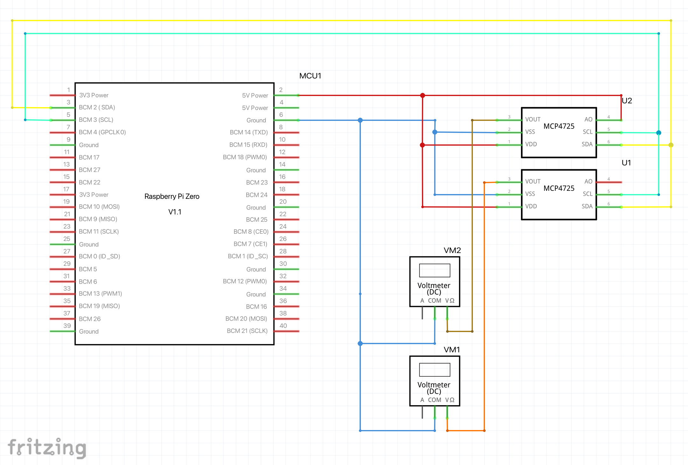

# About
Application used to show the current usage of the up and downstream on two analog gauges

See the detailed instructions here: https://www.instructables.com/Fritzmeter/

# Hardware

- Raspberry Pi Zero W
- 2x Adafruit MCP4725 12-Bit DAC  https://learn.adafruit.com/mcp4725-12-bit-dac-tutorial
- 2x 5V Analog gauges

## Gauges Background

The Background of the gauges can be created by the Hardware/Analog Gauges/CreateGaugesBackground.py Python script.

There will be two svg files created. One for the up and one for the download. The script can be edited to suit the network settings.

### Using the Python Gauge Background generator

#### Importing the needed libraries

To install pycairo we also need the dependencies of the C Headers. For mac os use:

> brew install cairo pkg-config

For other os´s check this article: https://pycairo.readthedocs.io/en/latest/getting_started.html

After installing the requested c-headers we can install pycairo.

> pip install pycairo

running the python script will create an output and show the file path of the two created files.

> python3 CreateGaugesBackground.py \
> Upload File saved here:/Users/esc/Git/FritzMeter_RaspberryPi/Hardware/upload.svg \
> Download File saved here:/Users/esc/Git/FritzMeter_RaspberryPi/Hardware/download.svg \
> Done

The output can be changed with the global constants ad the top

    UPLOAD_FILE_NAME = "upload.svg"
    DOWNLOAD_FILE_NAME = "download.svg"

    #Define the metrics of the gauge
    MAX_DOWNLOAD_SPEED = 200		#Set the max download speed here
    MAX_UPLOAD_SPEED = 30			#Set the max upload speed here

    BACKGROUND_SIZE_X = 650			#Fixed background settings. Do not change these.
    BACKGROUND_SIZE_Y = 400			#Fixed background settings. Do not change these.

    #Define the style of the gauges  
    FONT_LABEL = "Helvetica"			#Font of the labels
    FONT_LABEL_SIZE = 40				#Font size of the labels
    FONT_DESCRIPTION = "Helvetica"		#Font of the description
    FONT_DESCRIPTION_SIZE = 48			#Font size of the description

    UPLOAD_AXIS_DEVISION = 6			#Divisions of the upload gauges labels
    DOWNLOAD_AXIS_DEVISION = 4			#Divisions of the upload gauges labels

# Software

The application is written in python.

## fritzconnection

To connect with the fr!tz box routers we need an TR-064 libtrary to communicate. This Library can be used to retriev all needed informations drom the router.

## adafruit-circuitpython-mcp4725

### Usage / Info 

- GitHub: https://github.com/adafruit/Adafruit_CircuitPython_MCP4725

- Library Definition: https://circuitpython.readthedocs.io/projects/mcp4725/en/latest/api.html
- Create an SPI object: https://circuitpython.readthedocs.io/en/latest/shared-bindings/busio/index.html#busio.I2C

## netifaces

### Usage / Info

- Library Definition: https://0xbharath.github.io/python-network-programming/libraries/netifaces/index.html

# Pi Konfiguration

After installing the latest Raspbian OS from RaspberryPi.org update the systenm by:

>$ sudo apt-get update
> 
>$ sudo apt-get upgrade

## Install the requested libraries

>$ pip install fritzconnection adafruit-circuitpython-mcp4725 netifaces

## Create and start service

Source: https://www.nerdynat.com/programming/2019/run-python-on-your-raspberry-pi-as-background-service/

>$ sudo nano /lib/systemd/system/fritzmeter.service

Add the text from ./Software/Fritzmeter.service
Than change the permission

>$ sudo chmod 644 /lib/systemd/system/fritzmeter.service

Reload the system manager configuration

>$ sudo systemctl daemon-reload

Start the Service

>$ sudo systemctl start fritzmeter.service

Enable the service to start at boot 

>$ sudo systemctl enable fritzmeter.service

So stop the service you can use

>$ sudo systemctl stop fritzmeter.service

## Add the Background Light Script

>$ sudo nano /lib/systemd/system/Background_Light.service

Add the text from ./Software/Background_Light.service
Than change the permission

>$ sudo chmod 644 /lib/systemd/system/Background_Light.service

Reload the system manager configuration

>$ sudo systemctl daemon-reload

Start the Service

>$ sudo systemctl start Background_Light.service

Enable the service to start at boot 

>$ sudo systemctl enable Background_Light.service
